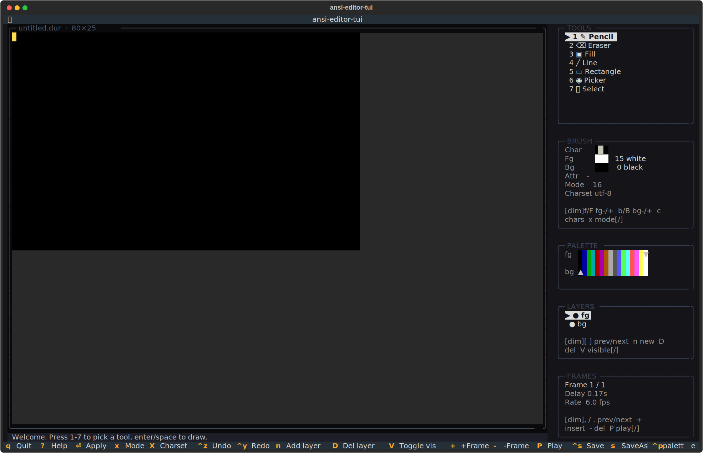
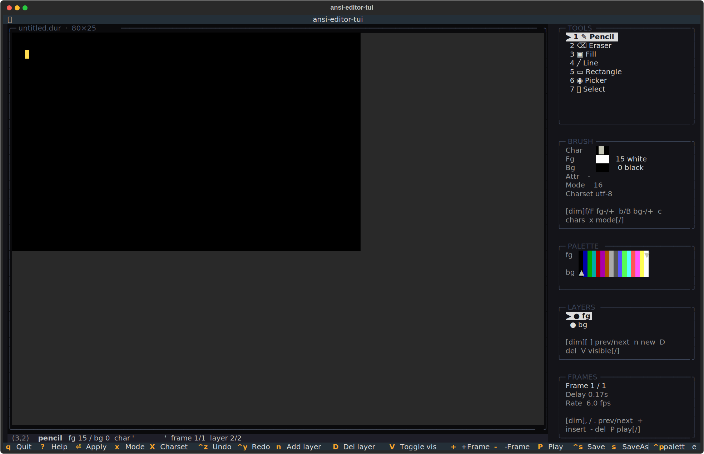

# ansi-editor-tui
Draw like it's 1992.




## About
A full Durdraw-compatible ANSI/ASCII art studio in the shell. Layers, animation frames, 16 and 256 color modes, pencil/fill/line/rect/picker tools, CP437 and Unicode palettes. The scene's native format, the scene's native workflow. Every frame as Big as you like.

## Screenshots


## Install & Run
```bash
git clone https://github.com/akakabrian/ansi-editor-tui
cd ansi-editor-tui
make
make run
```

## Controls
<Add controls info from code or existing README>

## Testing
```bash
make test       # QA harness
make playtest   # scripted critical-path run
make perf       # performance baseline
```

## License
MIT

## Built with
- [Textual](https://textual.textualize.io/) — the TUI framework
- [tui-game-build](https://github.com/akakabrian/tui-foundry) — shared build process
